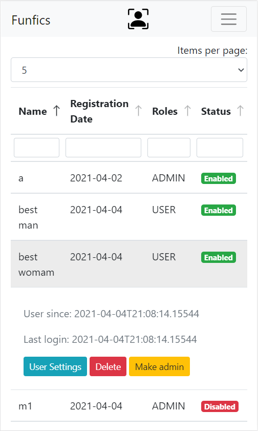

# Funfics

## Admin page

## Funfic page

## Personal funfics

## Info

- [Deployed app on heroku](https://give-me-funfics.herokuapp.com/)
    - Attention! The app can be in the sleeping mode, so it takes time to wake up the server.
- [React frontend project](https://github.com/pochka15/funfics-front)

This is a drill project where I tried to make a basic service for creating posts (so called funfics).

## Features

- Markdown posts
- Login/password authentication
- Websocket comments
- Admin page for managing users
- Funfics searchbar

## Notes

- There is no requirement to make very efficient Db queries, so there can even exist *N+1 problems*. I've added
  a [pending refactoring branch](https://github.com/pochka15/funfics/tree/pending-refactoring). I hope I find time for
  these refactorings...